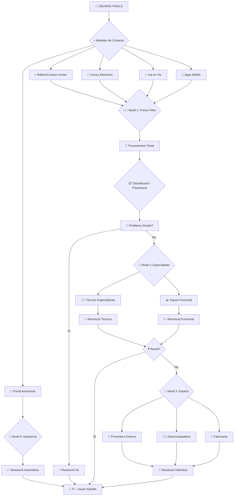

# 🎯 **Tema 26. El Servei d’Atenció a l’Usuari (SAU)**

## 🏛️ **1. Concepte i importància**

📌 **Definició**: El SAU és el **punt únic de contacte** (SPOC – Single Point of Contact) entre els usuaris i l'organització TIC.

🎯 **Objectiu principal**: Donar suport, resoldre incidències i peticions, i garantir la **continuïtat i qualitat** dels serveis TIC.

🤝 **Relació amb ITIL**: És una **funció fonamental** dins l'Operació del Servei.

---

## 📊 **2. Estructura organitzativa**

### 🏢 **2.1. Models de servei**

#### 🌐 **Centralitzat**
- Un únic SAU per tota l'organització
- ✅ **Avantatge**: Uniformitat, control central
- ❌ **Inconvenient**: Pot saturar-se

#### 🏘️ **Descentralitzat**
- Cada departament té el seu SAU
- ✅ **Avantatge**: Proximitat a l'usuari
- ❌ **Inconvenient**: Duplicitat d'esforços

#### 🔀 **Híbrid o federat**
- Combina centralització i descentralització

---

### 📈 **2.2. Nivells de suport**

#### 🟢 **Nivell 0 – Autoservei**
🤖 **Eines**: Portal d'autoservei, FAQ, chatbots, base de coneixement  
💡 **Exemple**: Reset de contrasenya via portal automàtic

#### 🔵 **Nivell 1 – Suport bàsic (Primer filtre)**
👥 **Qui**: Operadors del SAU  
🎯 **Tasques**: Registre tickets, resolució problemes senzills  
💡 **Exemple**: Error d'impressora, desbloqueig d'usuari

#### 🟡 **Nivell 2 – Suport tècnic especialitzat**
👨‍💻 **Qui**: Tècnics especialitzats  
🎯 **Tasques**: Diagnòstic avançat, configuració complexa  
💡 **Exemple**: Problema en servidor de bases de dades

#### 🔴 **Nivell 3 – Suport expert o extern**
🏢 **Qui**: Experts o proveïdors externs  
🎯 **Tasques**: Bugs greus, intervenció fabricants  
💡 **Exemple**: Error crític en SAP que requereix suport oficial

---

### 👥 **2.3. Rols clau en el SAU**

| 👤 **Rol** | 🎯 **Funció principal** | ⭐ **Habilitats necessàries** |
|------------|-------------------------|-----------------------------|
| **🧑‍💻 Operador/a SAU** | Punt de contacte inicial, registre i resolució bàsica | Comunicació, empatia, coneixements bàsics TIC |
| **👨‍💼 Coordinador/a SAU** | Supervisió flux tickets, assignació prioritats | Organització, lideratge, coneixement eines |
| **👩‍💼 Responsable SAU** | Estratègia, qualitat servei, millora contínua | Lideratge, visió estratègica, ITIL |
| **👨‍🔧 Tècnics especialitzats** | Resolució incidències complexes, suport avançat | Coneixement profund tecnologia específica |

---

## ⚙️ **3. Funcions principals del SAU**

### 📋 **1. Gestió d'incidències**
🔄 **Procés**: Recepció → Registre → Classificació → Assignació → Seguiment → Tancament  
💡 **Exemple**: Caiguda del correu corporatiu

### 📝 **2. Gestió de peticions de servei**
🎯 **Tasques**: Alta usuaris, assignació permisos, instal·lació software  
💡 **Exemple**: Sol·licitud accés a aplicació de nòmines

### 📢 **3. Comunicació amb l'usuari**
📞 **Canals**: Telèfon, correu, portal, xat  
💡 **Exemple**: Avís de manteniment planificat

### 📚 **4. Gestió del coneixement**
📖 **Objectiu**: Documentar i reutilitzar solucions  
💡 **Exemple**: Guia pas a pas per resoldre problemes VPN

### 🔭 **5. Suport proactiu**
🎯 **Objectiu**: Anticipar-se als problemes  
💡 **Exemple**: Detectar moltes incidències de contrasenyes → proposar portal autoservei

### 📊 **6. Monitorització i informes**
📈 **KPIs**: Temps resposta, SLA, satisfacció usuari  
💡 **Exemple**: Informe mensual d'indicadors de servei

### 🔗 **7. Integració amb ITIL**
🤝 **Relacions**: Gestió de Problemes, Canvis, Configuració  
💡 **Exemple**: Escalat d'incidències recurrents a Gestió de Problemes

---

## 🛠️ **4. Eines del SAU**

### 📋 **Plataformes de ticketing**
🛒 **Exemples**: ServiceNow, JIRA Service Desk, GLPI, Remedy  
🎯 **Funció**: Gestió completa de tickets

### 🖥️ **Monitorització i alertes**
📊 **Exemples**: Nagios, Zabbix, Prometheus  
🎯 **Funció**: Detecció proactiva de problemes

### 📞 **Canals de comunicació**
🔊 **Canals**: Telèfon, correu, portal web, xat, apps mòbils  
🎯 **Funció**: Contacte multicanals amb l'usuari

### 📚 **Bases de coneixement**
📖 **Exemples**: Wikis, intranets, Confluence  
🎯 **Funció**: Documentació i consulta de solucions

### 📈 **Gestió de SLA i indicadors**
📊 **Exemples**: Dashboards Power BI, Grafana  
🎯 **Funció**: Mesurar i visualitzar KPIs

### 🤖 **Automatització i IA**
⚡ **Exemples**: Chatbots, RPA (UiPath), scripts automàtics  
🎯 **Funció**: Resolució automàtica de tasques repetitives

---

## 📊 **5. Indicadors clau (KPIs)**

| 📊 **KPI** | 🎯 **Objectiu** | 📝 **Fórmula/Exemple** |
|------------|----------------|------------------------|
| **⏱️ Temps mitjà de resposta** | Rapidesa atenció inicial | 15 minuts de mitjana |
| **✅ Temps mitjà de resolució** | Rapidesa resolució completa | 3 hores de mitjana |
| **🎯 First Call Resolution (FCR)** | Eficiència primer contacte | 70% de casos resolts al primer contacte |
| **📋 Compliment de SLA** | Qualitat segons acords | 90% de tickets dins temps pactat |
| **🔄 Incidències recurrents** | Detecció problemes estructurals | 50 tickets/mes sobre mateix problema |
| **😊 Satisfacció de l'usuari (CSAT)** | Qualitat percebuda pels usuaris | 4,3/5 puntuació mitjana |
| **💰 Cost per ticket** | Eficiència pressupostària | 5 € per ticket |
| **📦 Backlog d'incidències** | Control càrrega de treball | 120 tickets pendents a final de mes |

---

## 🚀 **6. Reptes i tendències actuals**

### 🤖 **Autoservei i portals intel·ligents**
- Chatbots amb IA
- FAQ dinàmiques i personalitzades

### ⚡ **Automatització amb RPA i IA**
- Resolució automàtica de tasques repetitives
- Auto-healing de problemes coneguts

### 🌐 **Omnicanalitat**
- Atenció integrada via múltiples canals
- Experiència coherent independentment del canal

### 🔮 **Proactivitat**
- Predicció i prevenció d'incidències
- Anàlisi predictiva amb dades històriques

### 👥 **Gestió del coneixement col·laborativa**
- Wikis i bases de coneixement actualitzades per tots
- Sistemes de recomanació de solucions

### 🔗 **Integració amb ecosistemes corporatius**
- Connexió amb processos ITIL
- Integració amb sistemes de gestió empresarial

---

## 📌 **Resum visual**

### 🎯 **L'SAU és...**
- **🤝 El punt únic de contacte** entre usuaris i TI
- **⚙️ Una peça clau** en la Gestió de Serveis TIC
- **📊 Un centre de dades** per a la millora contínua

### 🔑 **Claus per a l'examen**
- Coneixement dels **4 nivells de suport** i les seves funcions
- Identificació dels **principals rols** del SAU
- Comprensió dels **KPIs més importants**
- Coneixement de les **tendències actuals** (IA, RPA, autoservei)

---

**💡 Recorda**: Un SAU eficient no només **respon** a problemes, sinó que **aprende** d'ells i **millora** contínuament el servei!

# 🏗️ **ESQUEMA VISUAL: ESTRUCTURA DEL SAU**

## 🎯 **NIVELS D'ATENCIÓ I ORGANITZACIÓ**



---

## 🔄 **FLUX DE TREBALL DEL SAU**

```
┌─────────────────────────────────────────────────────────────┐
│                     USUARIS FINALS                          │
│    (Empreses, Ciutadans, Administració, Col·laboradors)     │
└──────────────┬────────────────┬────────────────┬────────────┘
               │                │                │
    ┌──────────▼─────┐  ┌──────▼──────┐  ┌─────▼────────┐
    │   📱 Portal    │  │  📞 Telèfon │  │   📧 Correu  │
    │   Autoservei   │  │             │  │              │
    └──────────┬─────┘  └──────┬──────┘  └─────┬────────┘
               │                │                │
    ┌──────────▼────────────────▼────────────────▼──────────┐
    │         GESTOR DE TICKETS / SERVICE DESK              │
    │      (ServiceNow, JIRA, GLPI, Remedy, etc.)           │
    └───────────────────────────┬───────────────────────────┘
                                │
               ┌────────────────▼─────────────────┐
               │      CLASSIFICACIÓ AUTOMÀTICA    │
               │  (Impacte, Urgència, Categoria)  │
               └─────────────────┬─────────────────┘
                                 │
    ┌────────────────────────────▼────────────────────────────┐
    │                    EINES D'ESCLAT                       │
    │      (Assignació automàtica segons especialització)     │
    └────────────┬─────────────┬──────────────┬───────────────┘
                 │             │              │
        ┌────────▼──┐  ┌──────▼────┐  ┌──────▼──────┐
        │ 🟢 Nivell 1 │  │ 🟡 Nivell 2 │  │ 🔴 Nivell 3 │
        │  (Operador) │  │(Especialista)│ │ (Expert/Fab.)│
        └──────┬─────┘  └──────┬─────┘  └──────┬─────┘
               │                │               │
        ┌──────▼───────────────▼───────────────▼──────┐
        │        BASE DE CONEIXEMENT CENTRAL          │
        │      (Solucions, Guies, Best Practices)     │
        └──────────────────────┬──────────────────────┘
                               │
        ┌──────────────────────▼──────────────────────┐
        │           MONITORITZACIÓ I KPIs              │
        │   (Dashboards, SLA, CSAT, Temps Resposta)   │
        └──────────────────────┬──────────────────────┘
                               │
        ┌──────────────────────▼──────────────────────┐
        │            INFORME I ANÀLISI                 │
        │ (Tendències, Millores, Gestió de Problemes)  │
        └──────────────────────────────────────────────┘
```

---

## 🏢 **MODELS ORGANITZATIUS**

```
┌─────────────────────────────────────────────────────────┐
│                    MODEL CENTRALITZAT                   │
├─────────────────────────────────────────────────────────┤
│                                                         │
│   ┌─────────────────────────────────────────────────┐  │
│   │            SAU CENTRAL (ÚNIC)                  │  │
│   │  ┌─────────┐  ┌─────────┐  ┌─────────┐       │  │
│   │  │Operador1│  │Operador2│  │Operador3│  ...  │  │
│   │  └─────────┘  └─────────┘  └─────────┘       │  │
│   └─────────────────────────────────────────────────┘  │
│           ▲               ▲               ▲            │
│           │               │               │            │
│   ┌───────┴───────┐ ┌─────┴─────┐ ┌───────┴──────┐    │
│   │ Departament A │ │ Dept. B   │ │ Departament C│    │
│   │   (Tots els   │ │  (Tots els│ │   (Tots els  │    │
│   │   usuaris)    │ │   usuaris)│ │   usuaris)   │    │
│   └───────────────┘ └───────────┘ └──────────────┘    │
│                                                         │
└─────────────────────────────────────────────────────────┘

┌─────────────────────────────────────────────────────────┐
│                  MODEL DESCENTRALITZAT                  │
├─────────────────────────────────────────────────────────┤
│                                                         │
│   ┌──────────────┐  ┌──────────────┐  ┌──────────────┐│
│   │ SAU Depart.A │  │ SAU Depart.B │  │ SAU Depart.C ││
│   │ ┌──┐ ┌──┐    │  │ ┌──┐ ┌──┐    │  │ ┌──┐ ┌──┐    ││
│   │ │O1│ │O2│    │  │ │O1│ │O2│    │  │ │O1│ │O2│    ││
│   │ └──┘ └──┘    │  │ └──┘ └──┘    │  │ └──┘ └──┘    ││
│   └──────┬───────┘  └──────┬───────┘  └──────┬───────┘│
│          │                  │                 │        │
│   ┌──────▼───────┐  ┌──────▼──────┐  ┌──────▼──────┐ │
│   │ Usuaris DeptA│  │ Usuaris DeptB│  │ Usuaris DeptC││
│   └──────────────┘  └──────────────┘  └──────────────┘│
│                                                         │
└─────────────────────────────────────────────────────────┘

┌─────────────────────────────────────────────────────────┐
│                  MODEL HÍBRID/FEDERAT                   │
├─────────────────────────────────────────────────────────┤
│                                                         │
│           ┌─────────────────────────────┐              │
│           │      SAU CENTRAL (Core)     │              │
│           │  ┌─────────────────────┐    │              │
│           │  │Coordinació General  │    │              │
│           │  │Polítiques Globals   │    │              │
│           │  │Estadístiques        │    │              │
│           │  └─────────────────────┘    │              │
│           └─────────────┬───────────────┘              │
│                         │                              │
│    ┌────────────────────┼────────────────────┐         │
│    │                    │                    │         │
│┌───▼──────┐        ┌───▼──────┐        ┌───▼──────┐ │
││ SAU Local│        │ SAU Local│        │ SAU Local│ │
││  Regió A │        │  Regió B │        │  Regió C │ │
││  ┌──┐    │        │  ┌──┐    │        │  ┌──┐    │ │
││  │O1│    │        │  │O1│    │        │  │O1│    │ │
││  └──┘    │        │  └──┘    │        │  └──┘    │ │
│└────┬─────┘        └────┬─────┘        └────┬─────┘ │
│     │                   │                   │        │
│┌────▼─────┐        ┌────▼─────┐        ┌────▼─────┐ │
││Usuaris A │        │Usuaris B │        │Usuaris C │ │
│└──────────┘        └──────────┘        └──────────┘ │
│                                                         │
└─────────────────────────────────────────────────────────┘
```

---

## ⚙️ **ARQUITECTURA TÈCNICA DEL SAU**

```
┌─────────────────────────────────────────────────────────────┐
│               CANALS D'ENTRADA MULTIPLES                   │
│  📱Portal │ 📞Telèfon │ 📧Correu │ 💬Xat │ 🤖Chatbot      │
└─────────────┬─────────────────┬─────────────────┬──────────┘
              │                 │                 │
┌─────────────▼─────────────────▼─────────────────▼──────────┐
│          GESTOR DE TICKETS UNIFICAT (Service Desk)         │
│        ┌──────────────────────────────────────────┐        │
│        │ • Creació automàtica de tickets          │        │
│        │ • Classificació per tipus/urgència       │        │
│        │ • Assignació automàtica                  │        │
│        │ • Integració amb CMDB                    │        │
│        └──────────────────────────────────────────┘        │
└────────────────────────────┬────────────────────────────────┘
                             │
    ┌────────────────────────▼────────────────────────────────┐
    │                    RUTER INTEL·LIGENT                    │
    │     (Distribueix segons especialització i disponibilitat)│
    └──────┬────────────────┬─────────────────┬───────────────┘
           │                │                 │
    ┌──────▼─────┐  ┌──────▼──────┐  ┌───────▼──────┐
    │ 🟢 Nivell 1  │  │ 🟡 Nivell 2  │  │ 🔴 Nivell 3   │
    │ (Operadors) │  │(Especialistes)│ │ (Experts)    │
    │ • Atenció   │  │ • Diagnòstic  │ │ • Suport     │
    │   inicial   │  │   avançat     │ │   extern     │
    │ • Guies     │  │ • Configura-  │ │ • Bugs       │
    │   bàsiques  │  │   cions       │ │   complexos  │
    └──────┬─────┘  └──────┬──────┘  └───────┬──────┘
           │                │                 │
    ┌──────▼────────────────▼─────────────────▼──────┐
    │           BASE DE CONEIXEMENT CENTRAL           │
    │        ┌─────────────────────────────┐         │
    │        │ • Solucions documentades    │         │
    │        │ • Guies pas a pas           │         │
    │        │ • FAQ actualitzades         │         │
    │        │ • Casos d'èxit              │         │
    │        └─────────────────────────────┘         │
    └─────────────────────────┬───────────────────────┘
                              │
    ┌─────────────────────────▼───────────────────────┐
    │         EINES DE MONITORITZACIÓ I ANALÍTICA     │
    │        ┌─────────────────────────────┐         │
    │        │ • Dashboards en temps real  │         │
    │        │ • Alertes de SLA             │         │
    │        │ • Anàlisi predictiva         │         │
    │        │ • Informes automàtics        │         │
    │        └─────────────────────────────┘         │
    └─────────────────────────────────────────────────┘
```

---

## 📊 **PANELL DE CONTROL (DASHBOARD)**

```
┌─────────────────────────────────────────────────────────────┐
│                  📊 DASHBOARD DEL SAU                       │
├─────────────────────────────────────────────────────────────┤
│                                                             │
│  ┌──────────────────┐ ┌──────────────────┐ ┌─────────────┐ │
│  │   📈 VOLUM       │ │   ⏱️ TEMPS       │ │   🎯 SLA    │ │
│  │    • Trucades:   │ │    • Resposta:   │ │    • Compl.:│ │
│  │      1,200       │ │      15 min      │ │      92%    │ │
│  │    • Tickets:    │ │    • Resolució:  │ │    • Viol.: │ │
│  │      850         │ │      3h 20m      │ │      8%     │ │
│  │    • Emails:     │ │    • Espera:     │ │    • Objec: │ │
│  │      350         │ │      2 min       │ │      95%    │ │
│  └──────────────────┘ └──────────────────┘ └─────────────┘ │
│                                                             │
│  ┌──────────────────┐ ┌──────────────────┐ ┌─────────────┐ │
│  │   😊 SATISFACCIÓ │ │   🎯 EFICIÈNCIA  │ │   🔧 TIPUS  │ │
│  │    • CSAT:       │ │    • FCR:        │ │    • SW:    │ │
│  │      4.3/5       │ │      72%         │ │      45%    │ │
│  │    • NPS:        │ │    • Backlog:    │ │    • HW:    │ │
│  │      +42         │ │      120         │ │      25%    │ │
│  │    • Encertes:   │ │    • Reincid.:   │ │    • Xarxa: │ │
│  │      89%         │ │      15%         │ │      20%    │ │
│  └──────────────────┘ └──────────────────┘ └─────────────┘ │
│                                                             │
│  ┌──────────────────────────────────────────────────────┐  │
│  │                  📋 DISTRIBUCIÓ PER NIVELL           │  │
│  │                                                      │  │
│  │  🟢 N1: 65%   🟡 N2: 25%   🔴 N3: 8%   🟣 Externa: 2% │  │
│  │  ┌──────────┐ ┌──────────┐ ┌─────────┐ ┌──────────┐ │  │
│  │  │  552     │ │  212     │ │   68    │ │    17    │ │  │
│  │  └──────────┘ └──────────┘ └─────────┘ └──────────┘ │  │
│  │                                                      │  │
│  └──────────────────────────────────────────────────────┘  │
│                                                             │
│  ┌──────────────────────────────────────────────────────┐  │
│  │                ⚠️ INCIDÈNCIES CRÍTIQUES               │  │
│  │  • 🔴 SAP caigut (2h) - Assignat: Expert SAP        │  │
│  │  • 🟡 VPN lent (5h) - Assignat: Xarxes N2           │  │
│  │  • 🟢 Impressora bloquejada (15m) - Assignat: N1    │  │
│  └──────────────────────────────────────────────────────┘  │
│                                                             │
└─────────────────────────────────────────────────────────────┘
```

---

## 🔄 **CICLE DE VIDA D'UN TICKET**

```
┌───────┐     ┌─────────┐     ┌──────────┐     ┌──────────┐
│  📞   │────▶│   📋    │────▶│   🎯     │────▶│   👥     │
│Recepció│     │Registre │     │Classific.│     │Assignació│
└───────┘     └─────────┘     └──────────┘     └──────────┘
     │              │                │                │
     ▼              ▼                ▼                ▼
┌─────────┐   ┌─────────┐    ┌──────────┐    ┌──────────┐
│   🔍    │   │   ⚡     │    │   📞     │    │   🔧     │
│Anàlisi  │──▶│Diagnòstic│──▶│Comunicació│──▶│Resolució │
└─────────┘   └─────────┘    └──────────┘    └──────────┘
     │              │                │                │
     ▼              ▼                ▼                ▼
┌─────────┐   ┌─────────┐    ┌──────────┐    ┌──────────┐
│   ✅    │   │   📝     │    │   📚     │    │   📊     │
│Verific. │──▶│Tancament│──▶│Documentació│──▶│Anàlisi KPI│
└─────────┘   └─────────┘    └──────────┘    └──────────┘
```

---

## 🎨 **LEGENDES I ICONES**

| Icone | Significat |
|-------|------------|
| 🟢 **Nivell 1** | Suport bàsic / Primer filtre |
| 🟡 **Nivell 2** | Suport tècnic especialitzat |
| 🔴 **Nivell 3** | Suport expert o extern |
| 📞 | Contacte / Comunicació |
| 📋 | Gestió / Administració |
| 🔧 | Resolució / Reparació |
| 📊 | Mètriques / KPIs |
| 📚 | Coneixement / Documentació |
| 🤖 | Automatització / IA |
| ⚡ | Ràpid / Eficient |
| ✅ | Completat / Exitós |
| ⚠️ | Alert / Atenció |
| 🔄 | Procés / Flux |
| 🎯 | Objectiu / Focalització |

---

**💡 Aquests esquemes visuals et permeten veure clarament:**
- La **jerarquia** dels nivells de suport
- Els **fluxos** d'informació i tickets
- La **integració** entre diferents components
- Les **mètriques** clau per mesurar l'èxit
- Les **tendències** tecnològiques actuals