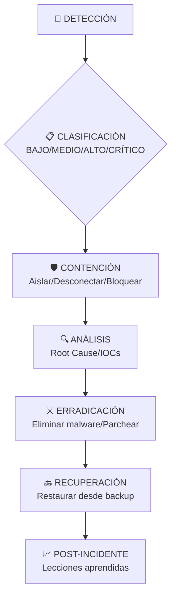

📘 **Tema 29 – Gestió d’Incidents de Ciberseguretat (versió OPOS-examen)**

---

## 1. Concepte i definicions clau

**Incident de seguretat**: qualsevol esdeveniment que comprometi o pugui comprometre la **confidencialitat, integritat o disponibilitat (CID)** de la informació, dels sistemes o dels serveis.

**Esdeveniment de seguretat**: succés observable (alerta, log, anomalia) que **no necessàriament** és un incident.

**Bretxa de seguretat de dades personals**: incident que comporta la destrucció, pèrdua, alteració, comunicació o accés no autoritzat a dades personals (RGPD).

**Gestió d’incidents de ciberseguretat**: conjunt de **processos, rols i eines** destinats a detectar, analitzar, contenir, eradicar i recuperar-se d’incidents de seguretat, així com a extreure’n aprenentatges.

---

## 2. Objectius de la gestió d’incidents

* Minimitzar l’impacte sobre serveis i informació.
* Restaurar la normalitat en el menor temps possible.
* Preservar evidències per a investigació forense.
* Garantir el compliment normatiu (ENS, RGPD, NIS2).
* Millorar contínuament la postura de seguretat.

---

## 3. Tipologia d’incidents de ciberseguretat

* **Accessos no autoritzats**: hacking, força bruta, escalat de privilegis.
* **Malware i ransomware**: infecció, xifrat, extorsió.
* **Denegació de servei (DoS/DDoS)**.
* **Enginyeria social**: phishing, smishing, vishing.
* **Fuita o pèrdua de dades**: dispositius, còpies no autoritzades.
* **Amenaces internes (insiders)**.
* **Errors de configuració** i vulnerabilitats no corregides.

---

## 4. Marc normatiu aplicable

### Esquema Nacional de Seguretat (ENS)

* Obliga a disposar d’un **procediment de gestió d’incidents**.
* Requereix **registre, classificació i tractament** dels incidents.
* Estableix el principi de **responsabilitats diferenciades**.
* Exigeix auditories de seguretat periòdiques.

### Reglament General de Protecció de Dades (RGPD)

* Notificació de bretxes a l’autoritat de control en **72 hores**.
* Comunicació a les persones afectades si el risc és alt.
* Obligació de **documentar totes les bretxes**, encara que no es notifiquin.

### Directiva NIS2

* Obliga a mesures de seguretat i notificació d’**incidents greus**.
* Afecta serveis essencials i serveis digitals.

*(Altres marcs de referència: ISO/IEC 27001, ISO/IEC 27035)*

---

## 5. Procés de gestió d’incidents

### 1. Preparació

* Pla de resposta a incidents.
* Definició de rols i responsabilitats.
* Eines de detecció i monitoratge.

### 2. Detecció i notificació

* Identificació d’alertes i indicadors.
* Distinció entre esdeveniment i incident.
* Escalat al SOC o CSIRT si escau.

### 3. Anàlisi i classificació

* Determinar origen, abast i impacte.
* Classificar la severitat (crític, alt, mitjà, baix).

### 4. Contenció

* Accions immediates per limitar l’impacte.
* Aïllament de sistemes afectats.

### 5. Eradicació

* Eliminació de la causa de l’incident.
* Correcció de vulnerabilitats.

### 6. Recuperació

* Restauració de serveis.
* Verificació del funcionament segur.

### 7. Aprenentatge i millora

* Informe post-incident.
* Revisió de procediments i controls.

---

## 6. Rols i actors implicats

* **CISO / Responsable de Seguretat**: coordinació global.
* **SOC (Security Operations Center)**: monitoratge i detecció.
* **CSIRT / CERT**: resposta especialitzada (CCN-CERT, INCIBE-CERT).
* **DPD (Delegat de Protecció de Dades)**: incidents amb dades personals.
* **Equip legal i comunicació**: notificacions i gestió reputacional.
* **Alta direcció**: decisions estratègiques.

---

## 7. Indicadors clau

* **MTTD (Mean Time To Detect)**.
* **MTTR (Mean Time To Respond / Recover)**.
* Nombre i tipologia d’incidents.

---

## 8. Eines habituals

* **SIEM**: correlació de logs i alertes.
* **IDS/IPS**: detecció i prevenció d’intrusions.
* **EDR/XDR**: resposta a incidents en endpoints.
* **SOAR**: automatització de la resposta.

---

## 9. Bones pràctiques

* Disposar d’un pla formal de resposta a incidents.
* Registrar i documentar tots els incidents.
* Simulacres i formació periòdica.
* Coordinació amb autoritats competents.

---

## 10. Idea clau per a examen

> **La gestió d’incidents de ciberseguretat no és només tècnica: és un procés organitzatiu, legal i comunicatiu orientat a minimitzar l’impacte i garantir el compliment normatiu.**


# 📚 **Tema 29 – Gestió d’Incidents de Ciberseguretat**  
## 🎯 Preparación para Oposiciones Técnico Superior TIC – Ayuntamiento de Barcelona  

---

## 📌 **ESQUEMA MUY REDUCIDO**  
1. **Introducció a la Gestió d’Incidents de Ciberseguretat**  
   - Definició i objectius.  
   - Marc normatiu i estàndards (ISO/IEC 27035, NIST SP 800-61).  

2. **Cicle de Vida d’un Incident**  
   - **Identificació** 🔍  
   - **Contenció** 🛡️  
   - **Eradicació** ⚔️  
   - **Recuperació** 🔄  
   - **Lliçons apreses** 📖  

3. **Equip de Resposta a Incidents (CSIRT/CERT)**  
   - Estructura i funcions.  
   - CSIRT del Sector Públic (CCN-CERT).  

4. **Procediments i Comunicació**  
   - Nivells de gravetat.  
   - Comunicació interna i externa.  

5. **Eines i Tecnologies**  
   - SIEM, IDS/IPS, forense digital.  

6. **Marco Legal**  
   - LOPDGDD, ENS, Directiva NIS2.  

---

## 🗝️ **CONCEPTES CLAU PER A L’EXAMEN**  

1. **Incident de ciberseguretat**: Esdeveniment que posa en risc la confidencialitat, integritat o disponibilitat dels sistemes o dades.  
2. **CSIRT/CERT**: Equip especialitzat en respondre a incidents (ex.: CCN-CERT per a l’administració pública).  
3. **Fases de gestió d’incidents**:  
   - **Preparació** 📋  
   - **Detectió i Anàlisi** 🔎  
   - **Contenció i Eradicació** 🚨  
   - **Recuperació** ✅  
   - **Revisió Post-Incident** 📊  
4. **Classificació d’incidents**:  
   - Baix, mitjà, alt, crític (segons impacte i urgència).  
5. **SIEM** (Security Information and Event Management): Eina centralitzada per a correlació de logs.  
6. **Forense digital**: Procés d’investigació per a preservar evidències digitals.  
7. **Comunicació durant un incident**:  
   - Interna: Equip directiu, jurídic, comunicació.  
   - Externa: Autoritats (CCN-CERT, Mossos), afectats si hi ha filtració de dades.  
8. **Marc legal rellevant**:  
   - **Llei Orgànica 3/2018 (LOPDGDD)**: Notificació de violacions de dades a l’APD en 72 hores.  
   - **Esquema Nacional de Seguretat (ENS)**: Requisits de seguretat per a l’administració pública.  
   - **Directiva NIS2**: Obligacions de notificació d’incidents significatius.  

---

## ⚠️ **TRAMPES / ERRORS FREQÜENTS EN EXAMEN TIPO TEST**  

1. **Confondre “detectió” amb “identificació”**:  
   - La **detectió** és sospitar de l’incident.  
   - La **identificació** és confirmar-lo i analitzar-lo.  

2. **Orde de les fases**:  
   - La **contenció** va **ABANS** de l’eradicació. No s’elimina l’amenaça sense contenir-la abans.  

3. **Notificacions legals**:  
   - **Violació de dades personals**: Notificar a l’APD en **72 hores**, no 48.  
   - **Incidents significatius segons NIS2**: Terminis específics (24 hores per a notificació inicial).  

4. **Actuacions incorrectes durant un incident**:  
   - **NO** apagar els sistemes immediatament (es perden evidències).  
   - **SÍ** aïllar la xarxa i preservar logs.  

5. **Confusió entre CERT i CSIRT**:  
   - **CERT** sol tenir un abast més ampli (comunitat o país).  
   - **CSIRT** pot ser d’una organització específica.  
   - En l’administració pública, es fa servir **CCN-CERT**.  

6. **Gravetat vs. Urgència**:  
   - **Gravetat**: Impacte en la organització.  
   - **Urgència**: Necessitat de resposta ràpida.  
   - Un incident pot ser d’alta gravetat però baixa urgència (ex.: atac lent de ransomware).  

---

## 🖥️ **GRÀFIC ASCII – Cicle de Vida d’un Incident**  

```
            ┌─────────────────────────────────────┐
            │         Preparació (Plans, Eines)   │
            └────────────────┬────────────────────┘
                             ▼
            ┌─────────────────────────────────────┐
            │   Detectió i Anàlisi (SIEM, IDS)    │ ◀─ Alerta
            └────────────────┬────────────────────┘
                             ▼
            ┌─────────────────────────────────────┐
            │       Contenció (Aïllar, Bloquejar) │
            └────────────────┬────────────────────┘
                             ▼
            ┌─────────────────────────────────────┐
            │   Eradicació (Eliminar amenaça)     │
            └────────────────┬────────────────────┘
                             ▼
            ┌─────────────────────────────────────┐
            │ Recuperació (Restaurar serveis)     │
            └────────────────┬────────────────────┘
                             ▼
            ┌─────────────────────────────────────┐
            │   Revisió Post-Incident (Informe)   │
            └─────────────────────────────────────┘
```

---

## 💡 **CONSELLS PER A L’EXAMEN**  
- 🧠 Memoritza les **fases en l’ordre correcte** i les **accions clau** de cada una.  
- 📚 Revisa els **terminis legals** de notificació (72 hores per a violació de dades).  
- 🔍 Posa atenció a les preguntes que mencionin **CCN-CERT** o **ENS**.  
- 🛡️ Recorda que la **preservació d’evidències** és crítica abans de prendre accions dràstiques (com apagar equips).  


# 🎯 **LISTA DE FRASES Y CONCEPTOS SUPER CLAVE - GESTIÓN DE INCIDENTES CIBERSEGURIDAD**

## 🏆 **FRASES CLAVE PARA MEMORIZAR**

### **Para Inicio de Respuesta**
```
✅ "Lo primero es **CONTENER** para evitar propagación"
✅ "Aplicamos el principio de **CONFIDENCIALIDAD, INTEGRIDAD Y DISPONIBILIDAD**"
✅ "Seguimos el **CICLO NIST de 4 FASES**: preparación, detección, respuesta, post-incidente"
```

### **Para Acciones Inmediatas**
```
🚨 "Desconectar de red inmediatamente si es **INCIDENTE CRÍTICO**"
🚨 "Preservar evidencias: **NO APAGAR EQUIPOS**, capturar memoria RAM"
🚨 "Notificar a **INCIBE-CERT** si afecta infraestructuras críticas"
```

### **Para Aspectos Legales**
```
⚖️ "Notificación RGPD: **72 HORAS MÁXIMO** a la AEPD"
⚖️ "Documentar TODO para posible **PROCEDIMIENTO LEGAL**"
⚖️ "Sanciones pueden llegar hasta **20 MILLONES DE EUROS** o 4% facturación"
```

### **Para Comunicación**
```
📢 "Comunicación **ESCALONADA**: técnicos → dirección → afectados → autoridades"
📢 "Designar un **PORTAVOZ ÚNICO** para coherencia informativa"
📢 "Preparar **FAQ** anticipando preguntas comunes"
```

### **Para Finalización**
```
📊 "El incidente NO TERMINA con la resolución, viene la **FASE POST-INCIDENTE**"
📊 "Medimos **MTTD y MTTR** para mejorar procesos"
📊 "Lecciones aprendidas → **MEJORA CONTINUA**"
```

---

## 🔤 **SIGLAS IMPRESCINDIBLES**

### **Organismos y Estándares**
```
🏛️ **NIST** - National Institute of Standards and Technology (EEUU)
🌍 **ISO/IEC 27035** - Estándar internacional gestión incidentes
🇪🇸 **INCIBE** - Instituto Nacional de Ciberseguridad
🇪🇸 **CCN-CERT** - Centro Criptológico Nacional
🇪🇸 **AEPD** - Agencia Española Protección Datos
🇪🇺 **CERT-EU** - CERT de la Unión Europea
⚖️ **RGPD** - Reglamento General Protección Datos
🏛️ **ENS** - Esquema Nacional de Seguridad (RD 3/2010)
```

### **Equipos y Centros**
```
👥 **CSIRT** - Computer Security Incident Response Team
👁️ **SOC** - Security Operations Center
🤖 **SOAR** - Security Orchestration Automation Response
🔍 **CERT** - Computer Emergency Response Team
```

### **Tecnologías y Herramientas**
```
📊 **SIEM** - Security Information & Event Management
💻 **EDR** - Endpoint Detection and Response
🔍 **XDR** - Extended Detection and Response
🛡️ **IDS/IPS** - Intrusion Detection/Prevention System
🎯 **IOC** - Indicator of Compromise
🎭 **TTP** - Tactics, Techniques & Procedures
🔗 **MITRE ATT&CK** - Framework de tácticas adversarios
```

### **Métricas Clave**
```
⏱️ **MTTD** - Mean Time to Detect (Tiempo medio detección)
⚡ **MTTR** - Mean Time to Respond (Tiempo medio respuesta)
⏰ **MTTA** - Mean Time to Acknowledge (Tiempo medio reconocimiento)
📈 **KPI** - Key Performance Indicator
💰 **ROI** - Return on Investment
```

---

## 🎯 **CONCEPTOS CLAVE DE UNA PALABRA**

### **Principios Fundamentales**
```
🛡️ **CIA** - Confidencialidad, Integritad, Disponibilidad
🎯 **DAD** - Disponibilidad, Autenticidad, Confidencialidad (alternativa)
🔐 **Defensa en Profundidad** - Múltiples capas seguridad
🚪 **Principio Mínimo Privilegio** - Solo acceso necesario
👥 **Separación de Funciones** - Dividir responsabilidades
🎭 **Zero Trust** - Nunca confiar, siempre verificar
```

### **Tipos de Incidentes**
```
🎣 **Phishing** - Suplantación identidad por email
🎯 **Spear Phishing** - Phishing dirigido específico
💀 **Ransomware** - Malware que cifra datos por rescate
🌊 **DDoS** - Ataque denegación servicio distribuido
🔗 **APT** - Advanced Persistent Threat (amenaza persistente avanzada)
📤 **Data Breach** - Violación/filtración datos
🤖 **Botnet** - Red dispositivos comprometidos
🎭 **Insider Threat** - Amenaza desde dentro organización
```

### **Fases y Etapas**
```
🛡️ **Preparación** - Antes incidente (planes, formación, herramientas)
🚨 **Detección** - Identificar incidente
🔍 **Análisis** - Investigar causa, alcance, impacto
🛑 **Contención** - Aislar y limitar daños
⚔️ **Erradicación** - Eliminar causa raíz
🔙 **Recuperación** - Restaurar normalidad
📊 **Post-Incidente** - Lecciones aprendidas
```

### **Aspectos Legales y Normativos**
```
⚖️ **Responsabilidad** - Obligación responder por daños
📜 **Cumplimiento** - Seguir leyes/regulaciones
🔍 **Auditoría** - Revisión procesos y controles
📝 **Evidencia Digital** - Pruebas admisibles judicialmente
⏰ **Plazo de Conservación** - Tiempo guardar logs/evidencias
```

### **Metodologías y Enfoques**
```
🔗 **Kill Chain** - Etapas ataque (reconocimiento, explotación, etc.)
🎯 **Diamond Model** - Modelo análisis intrusión
🧪 **Forensics** - Análisis forense digital
🎣 **Threat Hunting** - Búsqueda proactiva amenazas
🤝 **Information Sharing** - Compartir inteligencia amenazas
```

---

## 💡 **FRASES DE IMPACTO PARA EXAMEN**

### **Para Demostrar Conocimiento Técnico**
```
✅ "Implementamos **DEFENSA EN PROFUNDIDAD** con múltiples capas"
✅ "Seguimos enfoque **ZERO TRUST**: verificar siempre, confiar nunca"
✅ "Utilizamos **MITRE ATT&CK** para mapear tácticas adversario"
```

### **Para Mostrar Conocimiento Legal**
```
⚖️ "Cumplimos **RGPD** notificando en 72 horas a AEPD"
⚖️ "Aplicamos **ENS** para administraciones públicas"
⚖️ "Documentamos para posible **PROCEDIMIENTO ADMINISTRATIVO/SANCIONADOR**"
```

### **Para Enfatizar Buenas Prácticas**
```
📊 "Medimos **MTTD** para mejorar detección temprana"
📊 "Análisis **ROOT CAUSE** evita reincidencia"
📊 "**SIMULACIONES REGULARES** mantienen equipo preparado"
```

### **Para Respuestas de Gestión**
```
👥 "Coordinamos con **CSIRT NACIONAL** (INCIBE-CERT)"
👥 "Designamos **LÍDER DE INCIDENTE** para toma decisiones"
👥 "Comunicamos **TRANSPARENCIA** con afectados"
```

### **Para Cierre de Casos**
```
📋 "**INFORME POST-INCIDENTE** obligatorio con lecciones aprendidas"
📋 "Actualizamos **PLAYBOOKS** basado en experiencia"
📋 "Revisamos **POLÍTICAS Y PROCEDIMIENTOS**"
```

---

## 🎯 **ACRÓNIMOS PARA RECORDAR FÁCIL**

### **Mnemotécnicos Útiles**
```
🔐 **CIA** = Confidencialidad, Integridad, Disponibilidad
📅 **RGPD** = 72 horas = 3 días = ¡URGENTE!
🎯 **IOC** = Huellas digitales del atacante
👥 **CSIRT** = Equipo especializado en emergencias
📊 **SIEM** = Centraliza y correlaciona eventos
💀 **Ransomware** = Secuestro datos por dinero
```

### **Prioridades en Respuesta**
```
1️⃣ **CONTENER** - Parar hemorragia primero
2️⃣ **ANALIZAR** - Entender qué pasó
3️⃣ **COMUNICAR** - Informar a quien corresponda  
4️⃣ **DOCUMENTAR** - Todo para evidencias
5️⃣ **MEJORAR** - Evitar que vuelva a pasar
```

---

## 🚨 **FRASES DE ALERTA PARA EXAMEN PRÁCTICO**

### **Situación: Ransomware Detectado**
```
🚨 "¡INCIDENTE CRÍTICO! Desconectar inmediatamente de red"
🚨 "Preservar evidencias: NO PAGAR RESCATE, no apagar equipos"
🚨 "Activar backup offline verificado previamente"
```

### **Situación: Filtración Datos Personales**
```
⚖️ "Notificar AEPD en 72 HORAS desde detección"
⚖️ "Evaluar riesgo para afectados, comunicar si alto riesgo"
⚖️ "Revisar logs acceso para determinar alcance"
```

### **Situación: Ataque DDoS**
```
🌊 "Redirigir tráfico a servicio de mitigación DDoS"
🌊 "Contactar con ISP para filtrado tráfico malicioso"
🌊 "Monitorizar métricas para determinar fin ataque"
```

### **Situación: Phishing Masivo**
```
🎣 "Bloquear dominios/IPs emisores inmediatamente"
🎣 "Comunicar a TODOS empleados para alerta"
🎣 "Resetear contraseñas cuentas potencialmente comprometidas"
```

---

## 📚 **PARA MEMORIZAR COMO "MÁXIMAS"**

### **5 Máximas de la Gestión de Incidentes**
```
1️⃣ "CONTENER es la PRIMERA prioridad"
2️⃣ "DOCUMENTAR TODO es OBLIGATORIO"  
3️⃣ "72 HORAS para RGPD es LEY"
4️⃣ "POST-INCIDENTE es TAN IMPORTANTE como respuesta"
5️⃣ "PREPARACIÓN evita el 80% de problemas"
```

### **3 Reglas de Oro Comunicación**
```
📢 "UN solo portavoz oficial"
📢 "TRANSPARENCIA controlada (solo hechos verificados)"
📢 "ACTUALIZACIONES periódicas hasta resolución"
```

### **4 Noes de la Respuesta**
```
❌ "NO destruir evidencias"
❌ "NO comunicar sin autorización"  
❌ "NO actuar sin plan"
❌ "NO olvidar lecciones aprendidas"
```

---

**💡 CONSEJO FINAL**: En el examen, usa estas frases como **PALABRAS CLAVE** que demuestran conocimiento específico. Incluir términos como "MTTD", "CIA Triad", "INCIBE-CERT" o "72 horas RGPD" muestra dominio del tema inmediatamente.

# 🎯 **RESUMEN UNA PÁGINA: GESTIÓN DE INCIDENTES CIBERSEGURIDAD**

## 📊 **ESQUEMA GENERAL DEL PROCESO**



---

## 🔑 **CONCEPTOS CLAVE**

### **1. Principios CIA** 🎯
- **🔒 Confidencialidad**: Solo accesible por autorizados
- **✅ Integridad**: Datos exactos y completos  
- **🕐 Disponibilidad**: Accesibles cuando se necesitan

### **2. Tipos Incidentes Comunes** ⚠️
- **🎣 Phishing/Spear Phishing**
- **💀 Ransomware** (WannaCry, Ryuk)
- **🌊 DDoS/DoS** (Denegación de servicio)
- **📤 Data Exfiltration** (filtración datos)
- **🔗 Supply Chain Attacks** (SolarWinds)

---

## 🛠️ **4 FASES (NIST SP 800-61)**

### **FASE 1: PREPARACIÓN** 🛡️
```
📋 Plan de Respuesta + 👥 Equipo CSIRT + 🛠️ Herramientas SIEM/EDR
```

### **FASE 2: DETECCIÓN & ANÁLISIS** 🔍
```
🚨 Fuentes: IDS/IPS + 👁️ Usuarios + 🌐 CERTs
🎯 Clasificación por impacto (CIA) y priorización
```

### **FASE 3: CONTENCIÓN, ERRADICACIÓN & RECUPERACIÓN** ⚡
```
🛑 Aislar → 🔍 Analizar causa raíz → 🧹 Limpiar → 🔙 Restaurar
```

### **FASE 4: POST-INCIDENTE** 📊
```
📋 Informe técnico + 📈 KPIs (MTTR/MTTD) + 🔄 Lecciones aprendidas
```

---

## 👥 **EQUIPO CSIRT/SOC**

```
👨‍💼 Manager → 👨‍🔧 N1 Triage → 👨‍💻 N2 Investigadores → 👨‍⚖️ Legal/Compliance
```

**🔗 CSIRTs Nacionales**: 
- 🇪🇺 **CERT-EU** (UE)
- 🇪🇸 **INCIBE-CERT** (España)
- 🇪🇸 **CCN-CERT** (Centro Criptológico Nacional)

---

## ⚖️ **ASPECTOS LEGALES CRÍTICOS**

### **RGPD - Notificaciones Obligatorias** ⏰
```
📜 Artículo 33: Notificar a AEPD en 72 HORAS
📜 Artículo 34: Comunicar a afectados si ALTO RIESGO
```

### **Sanciones (España)** 💰
```
💰 Administrativas: Hasta 20M€ o 4% facturación
👮 Penales: Código Penal arts. 197, 264, 278
```

---

## 📊 **KPIs ESENCIALES**

```
⏱️ MTTD (Mean Time to Detect): <1h para críticos
⚡ MTTR (Mean Time to Respond): Objetivo reducción continua
🎯 % Incidentes contenidos: Indicador efectividad
💰 Coste incidente: Directo + Indirecto (reputación)
```

---

## 🚨 **PROCEDIMIENTOS DE ACTUACIÓN INMEDIATA**

### **1. Confirmar y Clasificar** ✅
- Verificar incidente real
- Asignar severidad (Alto/Crítico activar emergencia)

### **2. Contener** 🛑
- **Crítico**: Desconectar de red inmediatamente
- **Alto**: Aislar segmento afectado
- **Todos**: Cambiar credenciales comprometidas

### **3. Comunicar** 📢
- **Interno**: Equipo técnico → Dirección
- **Externo**: CERT.es (INCIBE) si grave
- **Legal**: AEPD si datos personales (72h máximo)

### **4. Preservar Evidencias** 🔍
- Capturar logs, memoria, tráfico
- No apagar equipos (pérdida memoria RAM)
- Documentar TODO con timestamps

---

## 🛡️ **MEJORES PRÁCTICAS PARA OPOSICIÓN**

### **Para Memorizar** 📚
1. **Fases NIST**: Prepara → Detecta → Contén → Analiza → Erradica → Recupera → Aprende
2. **CIA Triad**: Confidencialidad + Integridad + Disponibilidad  
3. **Plazo RGPD**: 72 horas para notificar
4. **KPIs clave**: MTTD y MTTR

### **Ejemplos Prácticos** 💡
- **WannaCry (2017)**: Ransomware → Importancia patch management
- **SolarWinds (2020)**: Supply chain attack → Necesidad zero trust
- **Log4J (2021)**: Vulnerabilidad crítica → Gestión dependencies

### **Siglas Importantes** 🔤
- **CSIRT**: Computer Security Incident Response Team
- **SOC**: Security Operations Center  
- **SIEM**: Security Information & Event Management
- **EDR**: Endpoint Detection and Response
- **IOC**: Indicator of Compromise
- **MTTD/MTTR**: Mean Time to Detect/Respond

---

## 🎯 **PUNTOS CLAVE EXAMEN**

1. **Conoce las 4 fases NIST** y qué se hace en cada una
2. **Diferenciar CSIRT vs SOC**: Estratégico vs Operacional
3. **Plazos legales RGPD**: 72h es CRÍTICO
4. **Ejemplos reales**: WannaCry, SolarWinds, Log4J
5. **Priorizar**: Confidencialidad > Integritad > Disponibilidad (según contexto)
6. **Documentar TODO**: Evidencias para legal y mejora continua

---

**💡 RECUERDA**: La gestión de incidentes no es solo técnica, es **25% técnica, 50% procesos, 25% comunicación**. Un buen profesional sabe tanto de firewalls como de redactar informes y hablar con dirección.