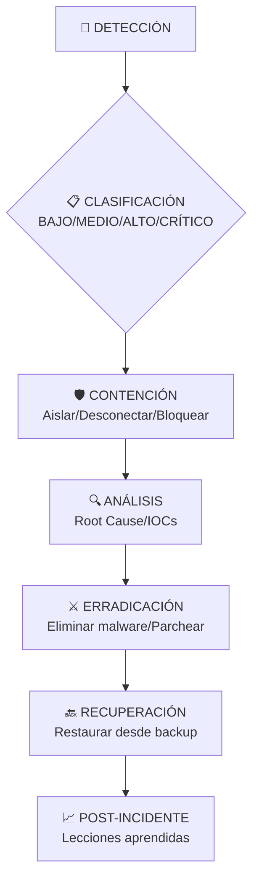

# 🎯 **RESUMEN UNA PÁGINA: GESTIÓN DE INCIDENTES CIBERSEGURIDAD**

## 📊 **ESQUEMA GENERAL DEL PROCESO**



---

## 🔑 **CONCEPTOS CLAVE**

### **1. Principios CIA** 🎯
- **🔒 Confidencialidad**: Solo accesible por autorizados
- **✅ Integridad**: Datos exactos y completos  
- **🕐 Disponibilidad**: Accesibles cuando se necesitan

### **2. Tipos Incidentes Comunes** ⚠️
- **🎣 Phishing/Spear Phishing**
- **💀 Ransomware** (WannaCry, Ryuk)
- **🌊 DDoS/DoS** (Denegación de servicio)
- **📤 Data Exfiltration** (filtración datos)
- **🔗 Supply Chain Attacks** (SolarWinds)

---

## 🛠️ **4 FASES (NIST SP 800-61)**

### **FASE 1: PREPARACIÓN** 🛡️
```
📋 Plan de Respuesta + 👥 Equipo CSIRT + 🛠️ Herramientas SIEM/EDR
```

### **FASE 2: DETECCIÓN & ANÁLISIS** 🔍
```
🚨 Fuentes: IDS/IPS + 👁️ Usuarios + 🌐 CERTs
🎯 Clasificación por impacto (CIA) y priorización
```

### **FASE 3: CONTENCIÓN, ERRADICACIÓN & RECUPERACIÓN** ⚡
```
🛑 Aislar → 🔍 Analizar causa raíz → 🧹 Limpiar → 🔙 Restaurar
```

### **FASE 4: POST-INCIDENTE** 📊
```
📋 Informe técnico + 📈 KPIs (MTTR/MTTD) + 🔄 Lecciones aprendidas
```

---

## 👥 **EQUIPO CSIRT/SOC**

```
👨‍💼 Manager → 👨‍🔧 N1 Triage → 👨‍💻 N2 Investigadores → 👨‍⚖️ Legal/Compliance
```

**🔗 CSIRTs Nacionales**: 
- 🇪🇺 **CERT-EU** (UE)
- 🇪🇸 **INCIBE-CERT** (España)
- 🇪🇸 **CCN-CERT** (Centro Criptológico Nacional)

---

## ⚖️ **ASPECTOS LEGALES CRÍTICOS**

### **RGPD - Notificaciones Obligatorias** ⏰
```
📜 Artículo 33: Notificar a AEPD en 72 HORAS
📜 Artículo 34: Comunicar a afectados si ALTO RIESGO
```

### **Sanciones (España)** 💰
```
💰 Administrativas: Hasta 20M€ o 4% facturación
👮 Penales: Código Penal arts. 197, 264, 278
```

---

## 📊 **KPIs ESENCIALES**

```
⏱️ MTTD (Mean Time to Detect): <1h para críticos
⚡ MTTR (Mean Time to Respond): Objetivo reducción continua
🎯 % Incidentes contenidos: Indicador efectividad
💰 Coste incidente: Directo + Indirecto (reputación)
```

---

## 🚨 **PROCEDIMIENTOS DE ACTUACIÓN INMEDIATA**

### **1. Confirmar y Clasificar** ✅
- Verificar incidente real
- Asignar severidad (Alto/Crítico activar emergencia)

### **2. Contener** 🛑
- **Crítico**: Desconectar de red inmediatamente
- **Alto**: Aislar segmento afectado
- **Todos**: Cambiar credenciales comprometidas

### **3. Comunicar** 📢
- **Interno**: Equipo técnico → Dirección
- **Externo**: CERT.es (INCIBE) si grave
- **Legal**: AEPD si datos personales (72h máximo)

### **4. Preservar Evidencias** 🔍
- Capturar logs, memoria, tráfico
- No apagar equipos (pérdida memoria RAM)
- Documentar TODO con timestamps

---

## 🛡️ **MEJORES PRÁCTICAS PARA OPOSICIÓN**

### **Para Memorizar** 📚
1. **Fases NIST**: Prepara → Detecta → Contén → Analiza → Erradica → Recupera → Aprende
2. **CIA Triad**: Confidencialidad + Integridad + Disponibilidad  
3. **Plazo RGPD**: 72 horas para notificar
4. **KPIs clave**: MTTD y MTTR

### **Ejemplos Prácticos** 💡
- **WannaCry (2017)**: Ransomware → Importancia patch management
- **SolarWinds (2020)**: Supply chain attack → Necesidad zero trust
- **Log4J (2021)**: Vulnerabilidad crítica → Gestión dependencies

### **Siglas Importantes** 🔤
- **CSIRT**: Computer Security Incident Response Team
- **SOC**: Security Operations Center  
- **SIEM**: Security Information & Event Management
- **EDR**: Endpoint Detection and Response
- **IOC**: Indicator of Compromise
- **MTTD/MTTR**: Mean Time to Detect/Respond

---

## 🎯 **PUNTOS CLAVE EXAMEN**

1. **Conoce las 4 fases NIST** y qué se hace en cada una
2. **Diferenciar CSIRT vs SOC**: Estratégico vs Operacional
3. **Plazos legales RGPD**: 72h es CRÍTICO
4. **Ejemplos reales**: WannaCry, SolarWinds, Log4J
5. **Priorizar**: Confidencialidad > Integritad > Disponibilidad (según contexto)
6. **Documentar TODO**: Evidencias para legal y mejora continua

---

**💡 RECUERDA**: La gestión de incidentes no es solo técnica, es **25% técnica, 50% procesos, 25% comunicación**. Un buen profesional sabe tanto de firewalls como de redactar informes y hablar con dirección.