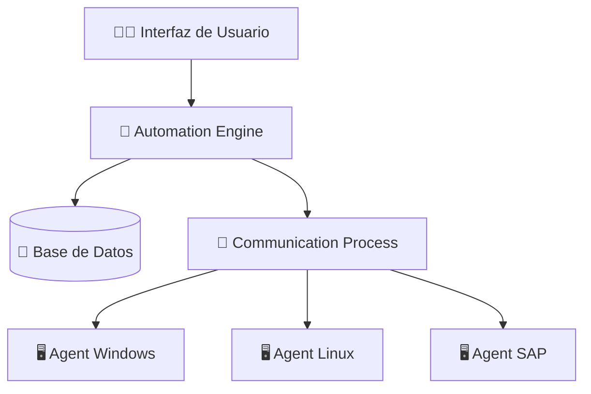
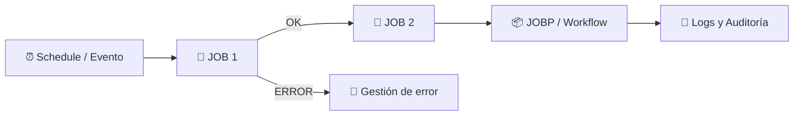
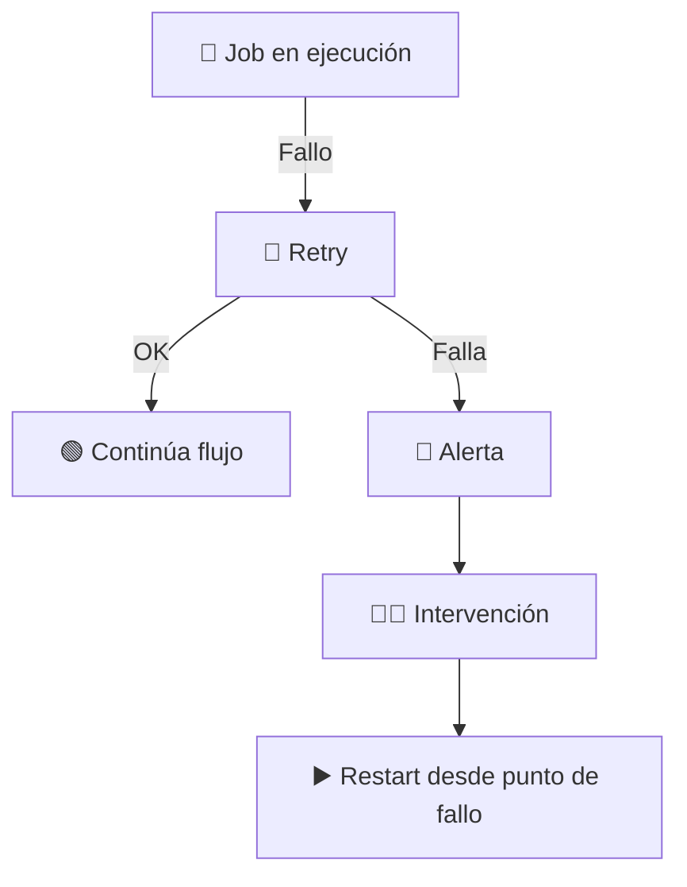
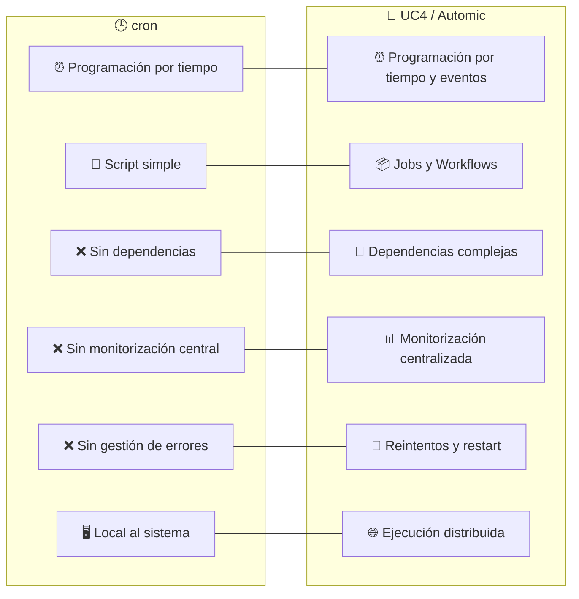

## 📊 Tema 31 – Gestión del Batch sobre UC4 (Automic)

### 🧾 Chuleta de examen ampliada (formato tabla)

---

### ⚙️ Conceptos generales

| 🔹 Concepto         | 📝 Clave técnica de examen                       |
| ------------------- | ------------------------------------------------ |
| Batch               | Procesos automáticos, recurrentes y desatendidos |
| Job scheduling      | Planificación y ejecución ordenada de jobs       |
| Workload Automation | Orquestación de procesos entre sistemas          |
| UC4 / Automic       | Scheduler corporativo y orquestador de cargas    |
| Orquestación        | Coordinación de múltiples procesos y sistemas    |
| SLA / ANS           | Cumplimiento de tiempos y ventanas de ejecución  |

---

### 🏗️ Arquitectura técnica

| 🧩 Componente          | 📝 Detalle técnico                             |
| ---------------------- | ---------------------------------------------- |
| Automation Engine (AE) | Motor central, reglas, dependencias y estados  |
| Database               | Persistencia, histórico, auditoría y reporting |
| Agents                 | Ejecutores remotos (Windows, Linux, Unix, SAP) |
| Communication Process  | Comunicación entre engine y agents             |
| Load Balancing         | Distribución de carga entre agents             |
| High Availability      | Soporte para entornos críticos                 |

---

### 📦 Objetos UC4

| 📄 Objeto    | 📝 Función técnica              |
| ------------ | ------------------------------- |
| JOB          | Script, comando o programa      |
| JOBP         | Flujo lógico de ejecución       |
| Workflow     | Representación gráfica del JOBP |
| Schedule     | Calendarios, fechas y ventanas  |
| Event        | Lanzadores condicionales        |
| VARA         | Variables estáticas y dinámicas |
| Calendar     | Días laborables y festivos      |
| PromptSet    | Interacción controlada          |
| Notification | Alertas automáticas             |

---

### 🔗 Dependencias y control

| 🔗 Tipo                  | 📝 Detalle                      |
| ------------------------ | ------------------------------- |
| Dependencia lógica       | Basada en estado del job        |
| Dependencia temporal     | Ventanas de ejecución           |
| Dependencia por recursos | CPU, licencias, colas           |
| Concurrencia             | Límites de ejecución simultánea |
| Prioridades              | Orden de ejecución              |
| Queues                   | Gestión de colas de ejecución   |

---

### 📊 Monitorización y operación

| 🔍 Función           | 📝 Clave técnica              |
| -------------------- | ----------------------------- |
| Real-time monitoring | Visualización inmediata       |
| Status codes         | OK / Running / Aborted        |
| Restart              | Reinicio desde punto de fallo |
| Rerun                | Nueva ejecución               |
| Escalado             | Gestión por niveles           |
| Alerting             | Avisos automáticos            |

---

### 🔐 Seguridad y gobierno

| 🛡️ Área                 | 📝 Concepto                  |
| ------------------------ | ---------------------------- |
| RBAC                     | Control de accesos por roles |
| Segregación de funciones | Operación vs administración  |
| Auditoría                | Trazabilidad completa        |
| Compliance               | ENS, políticas internas      |
| Gestión de entornos      | DEV / PRE / PRO              |

---

### 🔄 Integración y entornos

| 🌐 Ámbito   | 📝 Uso                            |
| ----------- | --------------------------------- |
| Sistemas    | SAP, bases de datos, ficheros     |
| Integración | Scripts, APIs, servicios          |
| Cloud       | Orquestación híbrida              |
| Legacy      | Integración con sistemas antiguos |

---

### ⚠️ Gestión de errores y resiliencia

| 🚨 Aspecto  | 📝 Clave                |
| ----------- | ----------------------- |
| Retry       | Reintentos automáticos  |
| Timeouts    | Control de bloqueos     |
| Fallback    | Flujos alternativos     |
| Checkpoints | Puntos de control       |
| Recovery    | Recuperación ante fallo |

---

### 🎯 Frases típicas de examen

| 📌                                                                                                 |
| -------------------------------------------------------------------------------------------------- |
| UC4 permite la automatización y orquestación de procesos batch complejos en entornos heterogéneos. |
| La gestión batch mejora fiabilidad, trazabilidad y cumplimiento de SLA.                            |
| UC4 separa lógica (Engine) de ejecución (Agents).                                                  |

---

Sí, hay **dos gráficos Mermaid muy útiles para examen**:

1. **Arquitectura UC4**
2. **Flujo típico de ejecución batch con dependencias**

Te los dejo listos para **memorizar estructura y lógica**, que es lo que más cae.

---

## 🧠 Gráfico 1 – Arquitectura básica de UC4 (muy preguntable)

### 📌 Cómo usarlo en examen

* El **Engine NO ejecuta jobs** → solo **coordina**
* Los **Agents ejecutan**
* La **BD guarda histórico, estados y logs**
* Arquitectura **centralizada pero ejecución distribuida**

👉 Frase típica:

> *UC4 separa la lógica de planificación de la ejecución mediante agents.*

---

## ⚙️ Gráfico 2 – Flujo de ejecución batch con dependencias

### 📌 Claves de examen

* El batch puede arrancar por **hora o evento**
* Las **dependencias controlan el flujo**
* Existen **ramas por error**
* Todo queda **auditado**

---

## 🔄 Gráfico 3 – Gestión de errores y recuperación (nivel fino)

### 📌 Clave importante

* **Restart ≠ Rerun**

  * Restart: continúa desde el fallo
  * Rerun: ejecuta todo de nuevo

---

## 🎯 Qué gráficos memorizan mejor los tribunales

* Arquitectura **Engine–Agents–BD**
* Flujo **Schedule → Job → Dependencias**
* Gestión de errores **automática + manual**

Perfecto. Este **gráfico comparativo UC4 vs cron en Mermaid** es **muy útil para examen**, porque permite **visualizar de un vistazo** lo que normalmente preguntan de forma teórica.

---

## ⚖️ Comparativa UC4 (Automic) vs cron

### 📊 Gráfico Mermaid comparativo

---

## 🧾 Tabla mental asociada (para memorizar)

| 🕒 cron             | 🧠 UC4                      |
| ------------------- | --------------------------- |
| Programación básica | Planificación avanzada      |
| Scripts locales     | Jobs y workflows            |
| Sin dependencias    | Dependencias complejas      |
| Sin control central | Monitorización centralizada |
| Sin recuperación    | Reintentos y restart        |
| Un solo sistema     | Multiplataforma             |
| Sin auditoría       | Logs y trazabilidad         |
| Uso simple          | Uso corporativo             |

---

## 🎯 Frases típicas de examen

* *cron es un planificador básico, mientras que UC4 es una plataforma de orquestación corporativa.*
* *UC4 permite gestionar dependencias, errores y trazabilidad, funcionalidades inexistentes en cron.*
* *UC4 separa la planificación de la ejecución mediante agents.*

---

## ⚠️ Trampa típica de test

❓ *¿cron puede sustituir a UC4 en entornos corporativos complejos?*
👉 **No**, cron **no gestiona dependencias, monitorización ni gobierno del batch**.

---
