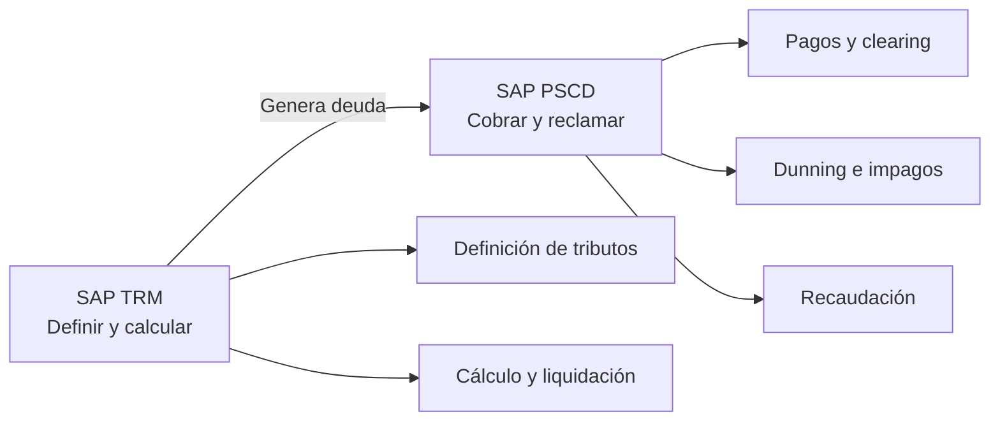

# 📄 RESUMEN EJECUTIVO — SAP TRM (Tax & Revenue Management)

## 1. Qué es SAP TRM

**SAP TRM (Tax & Revenue Management)** es la solución de SAP orientada a la **gestión integral de los ingresos públicos** en el sector público.
Permite **definir, calcular y liquidar** impuestos, tasas, sanciones y precios públicos, garantizando trazabilidad, automatización y cumplimiento normativo.

⚠️ No debe confundirse con **SAP Treasury & Risk Management**.

---

## 2. Alcance funcional

SAP TRM cubre el **ciclo funcional del ingreso público**, desde la definición normativa hasta la generación de la deuda, **pero no ejecuta el cobro**.

Incluye:

* Definición de tributos e ingresos
* Gestión del contribuyente
* Gestión del hecho imponible
* Cálculo y liquidación
* Generación de deuda

La **recaudación y los impagos** se gestionan mediante **SAP PSCD**.

---

## 3. Regla clave de examen

> **SAP TRM define y calcula; SAP PSCD recauda y gestiona impagos.**

---

## 4. Los 4 pilares / objetos básicos (TRM–PSCD)

1. **Business Partner (BP)**
   Representa al contribuyente (persona física o jurídica).

2. **Objeto contrato (Contract Object)**
   Representa el bien, actividad o hecho imponible (inmueble, vehículo, terraza, etc.).

3. **Product Definition**
   Define el tipo de ingreso (impuesto, tasa, sanción, precio público) y sus reglas.

4. **Cuenta contrato (Contract Account)**
   Cuenta económica donde se gestionan la deuda, los pagos y los impagos (PSCD).

Elemento asociado:

* **Documento PSCD**: registra los cargos y pagos económicos.

---

## 5. Funciones clave de soporte

* **BRF+**: motor de reglas de negocio para cálculos fiscales sin programación.
* **Case Management**: gestión de expedientes, recursos y reclamaciones.
* **ECM**: gestión documental (notificaciones, liquidaciones, resoluciones).
* **CAM (Central Address Management)**: gestión centralizada de direcciones.

---

## 6. Recaudación e impagos (PSCD)

SAP PSCD gestiona:

* Partidas abiertas (open items)
* Pagos y clearing
* Dunning (reclamación de impagos)
* Intereses y recargos
* Recaudación voluntaria y ejecutiva

---

## 7. Integraciones principales

* **FI / FM**: contabilización e imputación presupuestaria.
* **BW / SAC**: analítica, informes y cuadros de mando.
* **PO / CPI**: integración con sistemas externos (catastro, padrón, pasarelas de pago, portales).

---

## 8. Entornos SAP (ejemplo municipal)

Habitualmente se utilizan tres entornos:

* **Desarrollo (DEV / HMD)**
* **Integración–Preproducción (QAS / HMI)**
* **Producción (PRD / HMP)**

Flujo estándar de cambios:
**DEV → PRE → PRD**

---

## 9. Trampas habituales de examen

* TRM no gestiona pagos ni dunning.
* PSCD no define tributos.
* BP ≠ objeto contrato.
* Cuenta contrato ≠ tributo.
* BRF+ no es desarrollo ABAP.

---

## 10. Frase final de cierre

> *SAP TRM permite la definición y el cálculo de los ingresos públicos, apoyándose en PSCD para la recaudación y en FI/FM para la contabilización, integrándose con el resto del ecosistema SAP del sector público.*

Aquí tienes **un gráfico Mermaid pequeño, limpio y muy memorizable**, ideal para la **última noche**.
Resume **TRM + PSCD + los 4 objetos clave** en un solo vistazo.

---

### 🧠 SAP TRM — Esquema mental esencial

---

### Cómo memorizarlo en 10 segundos

* **BP** → quién
* **Objeto contrato** → sobre qué
* **Producto** → qué
* **Documento PSCD** → deuda/pago
* **Cuenta contrato** → dónde se gestiona

---

### Regla de oro (asócialo al gráfico)

> **TRM llega hasta el producto y el cálculo.
> PSCD empieza en el documento y gestiona el dinero.**

Perfecto. Aquí tienes un **Mermaid muy simple y directo**, ideal para **memorizar la diferencia TRM vs PSCD en 5 segundos**.

---

### 🧠 TRM vs PSCD — Quién hace qué

---

### Cómo usarlo para memorizar

* **TRM** = normativa + cálculo
* **PSCD** = dinero + impagos
* La **deuda pasa de TRM a PSCD**

---

### Frase asociada (memorízala con el gráfico)

> **TRM define y calcula; PSCD cobra y persigue el impago.**

---
