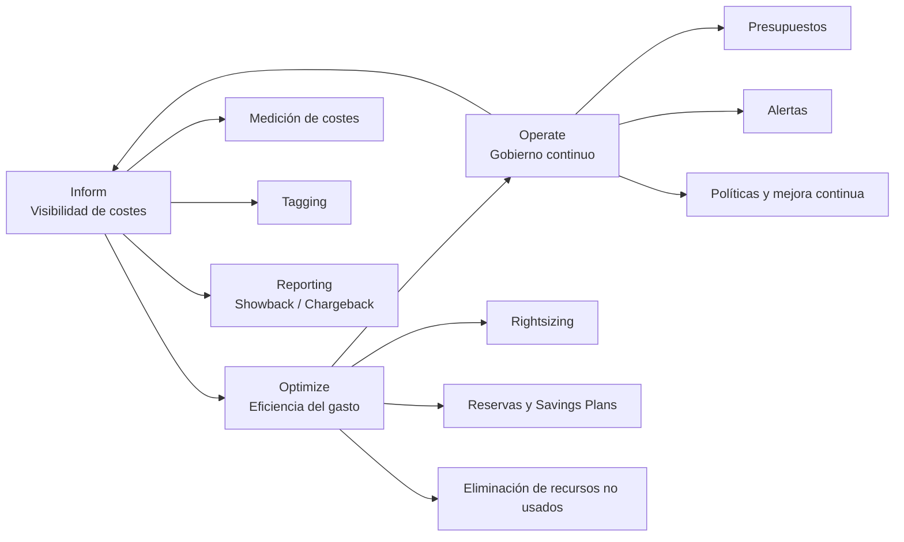

## **Tema 39: DevOps i FinOps**
1. **FinOps** → Ciclo de vida (Informar, Optimizar, Operar)  
2. **Métricas DORA** (Frecuencia despliegue, Lead time, Change failure rate, Time to restore)  
3. **Sync y Trivy** (herramientas DevSecOps)
- **Snyk**: Herramienta de seguridad que analiza dependencias, contenedores e infraestructura como código para detectar y corregir vulnerabilidades de forma continua en pipelines CI/CD.

- **Trivy**: Escáner de seguridad open source que identifica vulnerabilidades en imágenes de contenedores, sistemas de archivos e infraestructura como código, integrándose fácilmente en CI/CD.  
4. **SAFe DevOps** (CALMR, Continuous Delivery Pipeline)  
SAFe DevOps permite liberar valor de forma continua alineando desarrollo, operaciones y negocio.
5. **Flaky tests** (gestión en CI/CD)  
6. **E2E en CI** Pruebas automáticas que validan el flujo completo de la aplicación de extremo a extremo dentro del pipeline de Integración Continua, asegurando que todos los componentes funcionan juntos tras cada cambio.

### **Seguridad/DevSecOps**
1. **SAST** (Trivy vs SonarQube comparación)  
2. **DLP** (Data Loss Prevention)

## Roles en FinOps

| Rol                              | Función principal                                                  |
| -------------------------------- | ------------------------------------------------------------------ |
| **FinOps Practitioner**          | Optimización diaria del coste cloud, análisis y reporting          |
| **FinOps Lead**                  | Estrategia, gobernanza y coordinación entre IT, negocio y finanzas |
| **Engineering / IT**             | Diseño y operación de arquitecturas eficientes                     |
| **Finance / Procurement**        | Presupuesto, control financiero y relación con proveedores         |
| **Business Owners / Executives** | Decisiones de inversión y alineación con valor de negocio          |

---

### 📝 Frase clave de examen

> **FinOps es un modelo colaborativo que alinea IT, finanzas y negocio para maximizar el valor del gasto cloud.**

---

## 🔄 Ciclo FinOps (3 fases)

| Fase         | Objetivo                    | Qué se hace                                                              |
| ------------ | --------------------------- | ------------------------------------------------------------------------ |
| **Inform**   | Visibilidad y transparencia | Medición de costes, etiquetado (tagging), reporting, showback/chargeback |
| **Optimize** | Eficiencia del gasto        | Rightsizing, reservas, autoscaling, eliminación de recursos no usados    |
| **Operate**  | Gobierno continuo           | Presupuestos, alertas, políticas, mejora continua                        |

---

### 🧠 Cómo memorizarlo

👉 **Inform → Optimize → Operate**
👉 *Ver → Mejorar → Gobernar*

---

### 📝 Frase clave de examen

> **FinOps es un ciclo continuo que proporciona visibilidad, optimiza costes y establece gobierno del gasto cloud.**

---

### 🧠 Idea clave para examen

> **FinOps es un ciclo continuo (no lineal) que se retroalimenta constantemente.**
---

## **Métricas DORA**:

**Deployment Frequency**:
Frecuencia con la que una organización despliega cambios en producción.

**Lead Time for Changes**:
Tiempo desde que un cambio se confirma en el código hasta que llega a producción.

**Change Failure Rate**:
Porcentaje de despliegues que causan fallos en producción.

**Mean Time to Restore (MTTR)**:
Tiempo medio necesario para restaurar el servicio tras un fallo.

### 📝 Frase clave de examen

> **Las métricas DORA miden velocidad y estabilidad en la entrega de software.**

---

## Showback y Chargeback en FinOps

**Showback**:  
Práctica FinOps que muestra el coste del uso de recursos cloud a cada equipo o unidad de negocio sin imputación económica directa.

**Chargeback**:  
Práctica FinOps que asigna y repercute económicamente el coste real del uso de recursos cloud a cada equipo o unidad de negocio.

### 📝 Frase clave de examen

> **Showback informa; Chargeback responsabiliza económicamente.**

---

## DevSecOps, Shift-Left y Shift-Right

**DevSecOps**:  
Enfoque que integra la seguridad de forma continua en todo el ciclo de vida del desarrollo, desde el diseño hasta la operación.

**Shift-Left**:  
Práctica que adelanta actividades de calidad y seguridad a las primeras fases del desarrollo para detectar errores cuanto antes.

**Shift-Right**:  
Práctica que incorpora monitorización, observabilidad y feedback en producción para mejorar la calidad y seguridad en tiempo real.

### 📝 Frase clave de examen

> **DevSecOps integra la seguridad desde el inicio; shift-left previene, shift-right aprende en producción.**

---
## Allied Personas (SAFe)

**Allied Personas**:  
Roles y perfiles que colaboran con los equipos ágiles y DevOps para apoyar la entrega de valor, sin formar parte directa del equipo de desarrollo.

### 📝 Frase clave de examen

> **Las Allied Personas complementan a los equipos ágiles aportando capacidades especializadas sin integrarse directamente en el equipo.**

---

## CALMS (DevOps)

**C – Culture**:  
Fomenta la colaboración, la confianza y la responsabilidad compartida entre desarrollo, operaciones y negocio.

**A – Automation**:  
Automatiza procesos de build, test, despliegue e infraestructura para reducir errores y acelerar la entrega.

**L – Lean**:  
Aplica principios lean para eliminar desperdicios y optimizar el flujo de valor.

**M – Measurement**:  
Mide el rendimiento mediante métricas para mejorar continuamente (DORA, KPIs).

**S – Sharing**:  
Promueve el intercambio de conocimiento, feedback y aprendizaje continuo entre equipos.

### 📝 Frase clave de examen

> **CALMS define los pilares culturales y técnicos que sustentan DevOps.**

---
