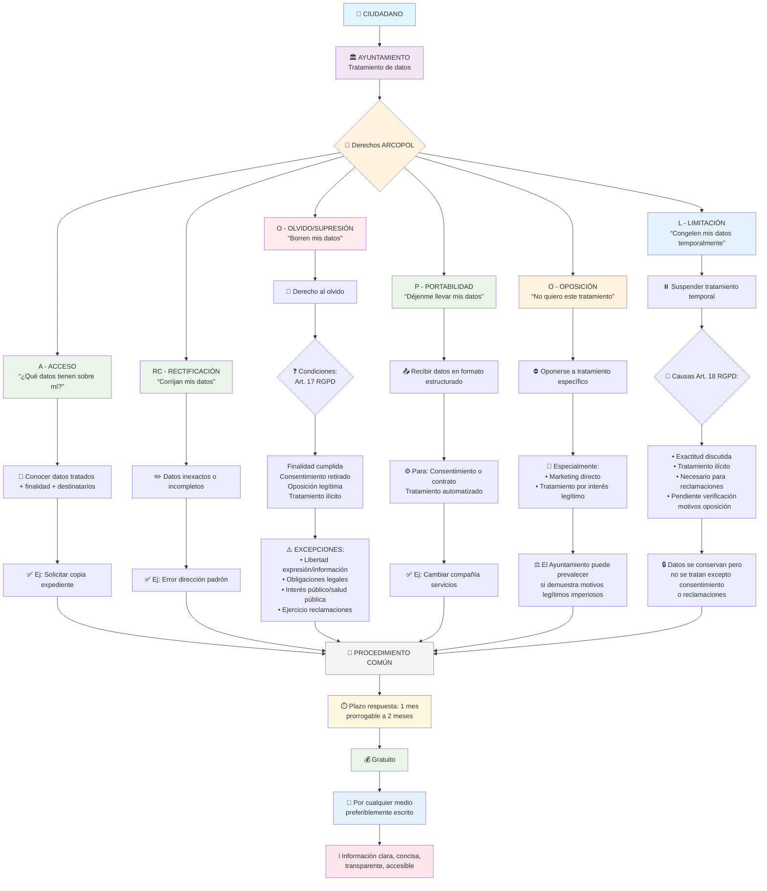

[link a mermaid live - Derechos ARCOPOL](https://mermaid.live/view#pako:eNp9Vstu20YU_ZUBu6xs62nLQpFCJimZiV6VlKKtnMWIHMrjkhx2SKpODANZpLuiRuOgQJ0EKYoAbRZGG3STdFOg-hP_QPMJvTMjUrRjxwuZ1H3Muefee0ZHms0cojU012Pf2vuYx2hs7AUI_pqTdy9-fIl0667RNJq9_j20tnYL7cC3J0__e3OCml_e7Y2bXcvsjfufTPnGrTHHMfYpCWKGHIIcHLPonsqlPndkBv3o3Ysf_kAG4cTeZxFqDvX-oN85znvq0tOYNNEaauq6OVInXDx89u8_nyWLVyo5iuEwEqCITTlB_uL804uHz5cnGipDCeCePkI6C5hNeBomgDrw8DFyaYA96mAHnh0SxfAaY04z4EZJ5SlPLp59h8yDBhoxj9oUnJDNQooROQyJI4om996vwJwM4QENTX1stSy9qVuL015ais44pwc4QD6NFLIVfFOFl-DYE0G2IYHTgBxiWzwxeLaZH3pkRbKpsJorrCbnDIqmwLRNF38FKMQOh__XIG1N-gC03_ncMvobo7uDoTnKY90BrORapC0VLoj-7W3aVYQ9xLw5dVjqpbC1ykcXz09FOxwgkQUkasgTmjxeR6UtNGwPjOUgtMoqojJpZT2yE6gYnmQMJImAdrqcOE5iyqGr0tYPWURVyR6ZLc7BC783o9RbnEMnM4gVdWB1cnH2i-Dc_EI3B7rV75mjxpKHX1GHTgmH6RF95yQSR2zQwGXcx_K8zLE_9egMqyIFCOyRKDNaMC588SpC4eJv8LPZRoS9xElfceZoHhBuC6qgPtvD_jLhNQ1sTwbQwEF_OG7uWB0LdjbtnbF4dUACnyDPI3OY22ua2FYp5La8RENi0ylNtwXaLssDxmBBeGLHieA5jVSNbcPQnf0sWBtgjhvoSnMYLEsg1o691wWcxAyS0we5nKr17Uo2yDr2p1SunB_ixevFOUYR4XNBzHVc7KphHvRH1qWN6zH0TUIJl5UQpQMKxoqKXZUBNu_pEwRzFBAeEYTzzhAdEntx7kLj0ihFw255IsXNFA4Ue77QhdXwdDH_GsY0mKmdXLIhLHlGQthZmg5IOr7ZQYqbXeDm7Cc5pR5q3k-CVXRCQHxhNucwcaB58oiIgrr5iegfRj6L6ZzlUoOw-CERqnctm9akA2x2rK41vipgwYx4eVlAMfEB_rLwFamWSgSknrwRoEcJEBQ4oMh5WtPgNEhxapXhwjj9HmYgiTBcF1Iq6lIqGkutsBQpFpAidkZoJI1hnRwa2UmcCsZVntP9z4w94CsS6g86CTxd2rjMaQC4pdyjOVAGI5Dbe4CSkssyBUqrUfJiVWFCnjxeCjpMli02hc_hGoAWKCwBEwbJTADMk0ObhDFTntlOSc8PyYKhSLktdvo5Ggz7umlY6rpGer-7OOul98bScSmD1fxbu5J_2730Zl3yVJ-35Vd3oM-vpRh4-IHAGIVi9kAXSshfchnC1cTZDE89sV1l8X1WwB2ZpQPIH_-J2sBDspLpjrR1RVW_owGsip1gT241pHCo4gVYgw1woUGQXs4i7KzNV1m6MktvcvHorcBp5RQcAaEcFwTdNo1wQSaEZgQRTIVIVUDYhkERqS8RHsX3oZYm_KbwvMZHpOTWXJK37CwtboXU3FreoqcWF2zFvMVIs9XdGqnnLeaNllaWjUzJJQTtG2N2b0RgpTEVt-w6ecvtNKbmXqnnzipbnZTyls6NCLo3ntNLs9mkSuy9QCtoM04dreFiLyIFzSfQOvGuHYmwPS3eh57vaQ14dEBx97S94BiCQhx8xZivNeASgzDOktl-liQJQcCIQfGM45WL1CidgbxqjZrMoDWOtEOtUSpurm_Vitub2_XS5nZlu1opaPe1xlq5vr5drVaK9WKlWq1tlcqV44L2QJ5aWi9ul-qbxdJWrVQpwwckhIGNGe-qn-Dyl_jx_6At-8I)

---

## **📌 EXPLICACIÓN DEL DIAGRAMA "ARCOPOL":**

### **🔤 El acrónimo ARCOPOL:**
- **A** → Acceso
- **RC** → Rectificación  
- **O** → Olvido (Supresión)
- **P** → Portabilidad
- **O** → Oposición
- **L** → Limitación

### **🎯 Características comunes:**
1. **Plazo:** 1 mes (prorrogable a 2 meses)
2. **Gratuito:** Sin coste para el ciudadano
3. **Forma:** Por cualquier medio, preferiblemente escrito
4. **Información:** Clara, concisa y accesible

### **⚠️ Aspectos clave para el examen:**
- **Olvido ≠ Absoluto:** Tiene importantes excepciones (obligaciones legales, interés público...)
- **Portabilidad limitada:** Solo para datos proporcionados bajo consentimiento o contrato
- **Oposición específica:** No es un "no a todo", sino a tratamientos concretos
- **Limitación temporal:** Los datos se conservan pero no se tratan

### **🏛️ En el contexto del Ayuntamiento:**
- **Ejemplo Acceso:** "Deme copia de mi expediente de servicios sociales"
- **Ejemplo Rectificación:** "Mi dirección en el padrón es incorrecta"
- **Ejemplo Olvido (excepción):** "No pueden borrarme del padrón si sigo viviendo aquí"
- **Ejemplo Oposición:** "No quiero recibir información sobre obras en mi barrio"
- **Ejemplo Limitación:** "Congelen mis datos hasta que se resuelva mi reclamación"

**¿Quieres que profundice en algún derecho específico o en cómo se ejercen estos derechos en la práctica en el Ayuntamiento?**